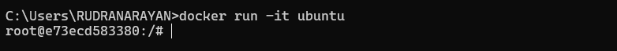
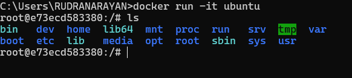
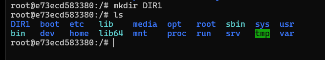
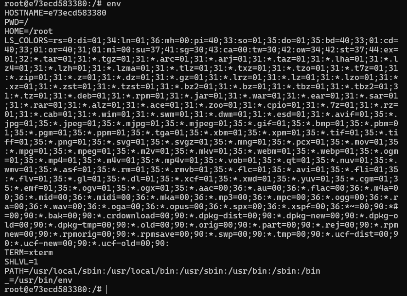
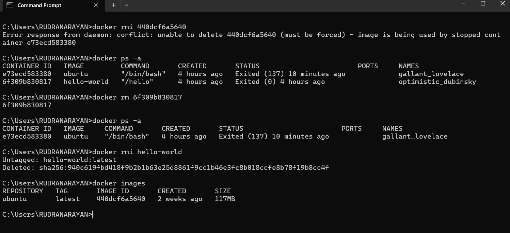
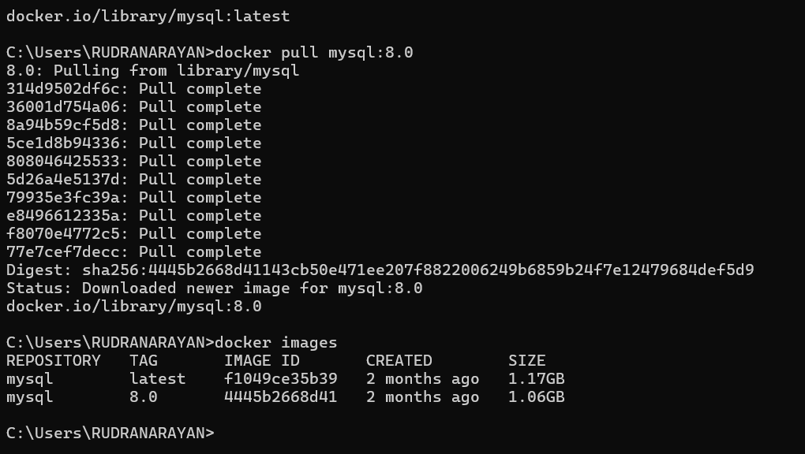

# Docker
- Docker is a open source platform
- Using for building, running, managing applications by packing them into a standardize unit called container. 
- Docker has two components docker container and docker images 

## Docker Container 
- A standardized, executable unit of software that packages up code and all its dependencies, so the application runs quickly and reliably from one computing environment to another.

## Docker Images 
- A read-only template that contains the application code, runtime, system tools, libraries, and dependencies needed to run an application. 
- It's a blueprint for creating Docker containers, which are isolated instances of an application and its environment.
- Tag is like a version or varient of docker images.

## Installation 
- Install docker from official website and it's easy and just click and install 
- After installation check is it installed suuccessfully on our system by typing in cmd 
``` bash
docker
docker -v 
```

## Docker Hub
- Docker hub contains all the public collections of docker images https://hub.docker.com/

## Docker Commands 

- docker pull IMAGE_NAME
    It is used to pull image from docker hub 
    ```bash
         docker pull hello-world
    ```
- docker images
    It shows all the available images 
    ```bash 
        docker images
    ```
- docker run IMAGE_NAME
    Used to buiild container from image
    ```bash
        docker run hello-world
    ```

- docker run -it IMAGE_NAME
    Used to buiild container from image which will run in interractive mode 
    ```bash
        docker pull ubuntu
        docker run -it ubuntu
    ```
    Now we are inside ubuntu container 
    

    Let's try some ubuntum commands 
    ```bash
        ls
    ```
    

    Let's create a directory inside ubuntu container 
    ```bash 
        mkdir DIR1
    ```
    

    Let's print different environment variables availbale inside ubuntu container
    ```bash 
        env
    ```
    

    Let's exit from the container
    ```bash 
        exit
    ```
    After the execution of exit command our container will stop running and back to system CLI


- docker ps 

     To check all the running container (ps - process status)
     ```bash 
     docker ps
    ```
    To check all the available container 
    ```bash 
    docker ps -a 
    ```

- dcoker start CONT_NAME or CONT_ID
- dcoker stop CONT_NAME or CONT_ID

    These two comands are used to start or stop the container 

    Starting the container with container Id 
    ```bash
        docker start e73ecd583380
    ```

    Stoppng the container with name
    ```bash 
        docker stop gallant_lovelace
    ```

- docker rmi IMAGE_NAME

    This command is used to remove or destroy image 

    NB: To delete the image we need to destroy the container first

- docker rm CONT_ID
    Used to remove container 




## Versions in docker Images

    Docker versions are required when we want to pull a specific version of a image (image with specific tag).
    Generally if we are pulling a image from docker hub without any tag then it will pull the latest version (image with latest tag) of that image.

    ```bash 
        docker pull mysql
    ```
It will pull the mysql with latest tag.


Here we are trying to pull mysql with specific tag or specific version
```bash
    docker pull mysql:8.0
```


